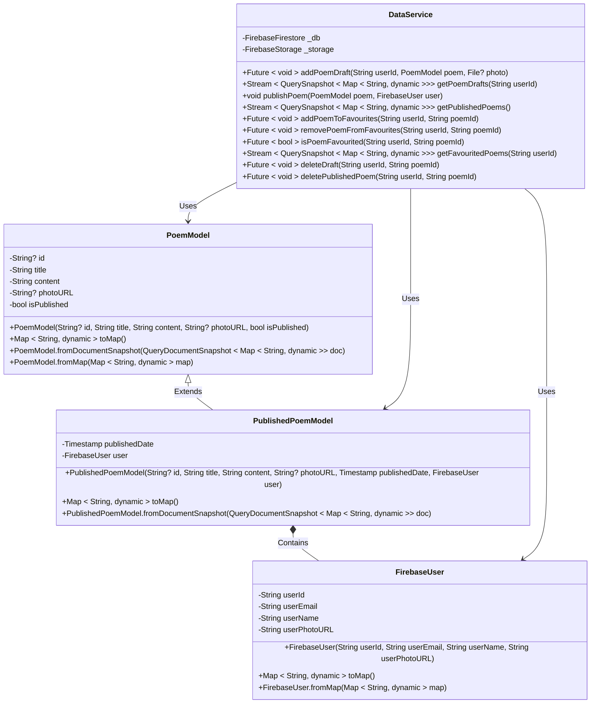

## Backend Class Diagram

The app uses Firebase for it's backend. The `model` classes are used to represent Firestore objects. The `DataService` contains the logic for retrieving, updating, and deleting the data.

