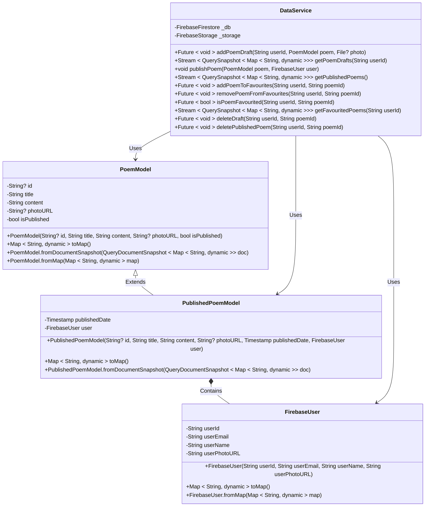

# Firestore Class Diagram

### Clase

1. Clasa `FirebaseUser` reprezintă un utilizator în sistemul Firebase. Conține informații precum ID-ul, emailul, numele și URL-ul fotografiei utilizatorului.
2.  Clasa `PoemModel` reprezintă modelul unui poem nepublicat). Include câmpuri precum ID-ul poemului (opțional), titlul, conținutul, URL-ul pentru o fotografie (opțional) și un indicator al stării de publicare.
3.  Clasa `PublishedPoemModel` este o extensie a clasei PoemModel, destinată poemelor publicate. Conține un câmp suplimentar pentru data publicării și un obiect FirebaseUser care reprezintă autorul.
4.  Clasa `DataService` se ocupă cu logica de interacțiune și manipulare a datelor. Interacționează cu baza de date Firestore (_db) și cu Firebase Storage (_storage). Include metode pentru adăugarea, publicarea, favorizarea, ștergerea poemelor și pentru gestionarea poemelor favorite.

### Relațiile dintre clase

1.  `PublishedPoemModel` extinde `PoemModel`, moștenind toate proprietățile acestuia și adăugând un timestamp cu data cand a fost publicat si datele user-ului care l-a publicat.
2.  `PublishedPoemModel` conține un obiect `FirebaseUser`.
3.  `DataService` utilizează clasele `FirebaseUser`, `PoemModel` și `PublishedPoemModel` pentru diverse operațiuni cu baza de date din Firebase.

