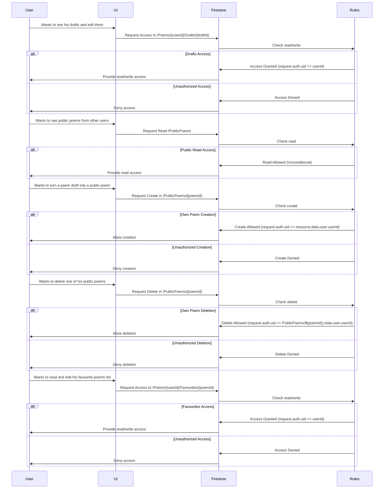

```mermaid
sequenceDiagram
    participant User
    participant UI
    participant Firestore
    participant Rules

    User->>UI: Wants to see his drafts and edit them
    UI->>Firestore: Request Access to /Poems/{userId}/Drafts/{draftId}
    Firestore->>Rules: Check read/write
    alt Drafts Access
        Rules->>Firestore: Access Granted (request.auth.uid == userId)
        Firestore->>User: Provide read/write access
    else Unauthorized Access
        Rules->>Firestore: Access Denied
        Firestore->>User: Deny access
    end

    User->>UI: Wants to see public poems from other users
    UI->>Firestore: Request Read /PublicPoems
    Firestore->>Rules: Check read
    alt Public Read Access
        Rules->>Firestore: Read Allowed (Unconditional)
        Firestore->>User: Provide read access
    end

    User->>UI: Wants to turn a poem draft into a public poem
    UI->>Firestore: Request Create in /PublicPoems/{poemId}
    Firestore->>Rules: Check create
    alt Own Poem Creation
        Rules->>Firestore: Create Allowed (request.auth.uid == resource.data.user.userId)
        Firestore->>User: Allow creation
    else Unauthorized Creation
        Rules->>Firestore: Create Denied
        Firestore->>User: Deny creation
    end

    User->>UI: Wants to delete one of his public poems
    UI->>Firestore: Request Delete in /PublicPoems/{poemId}
    Firestore->>Rules: Check delete
    alt Own Poem Deletion
        Rules->>Firestore: Delete Allowed (request.auth.uid == PublicPoems/$(poemId)).data.user.userId)
        Firestore->>User: Allow deletion
    else Unauthorized Deletion
        Rules->>Firestore: Delete Denied
        Firestore->>User: Deny deletion
    end

    User->>UI: Wants to read and edit his favourite poems list
    UI->>Firestore: Request Access to /Poems/{userId}/Favourites/{poemId}
    Firestore->>Rules: Check read/write
    alt Favourites Access
        Rules->>Firestore: Access Granted (request.auth.uid == userId)
        Firestore->>User: Provide read/write access
    else Unauthorized Access
        Rules->>Firestore: Access Denied
        Firestore->>User: Deny access
    end

```
