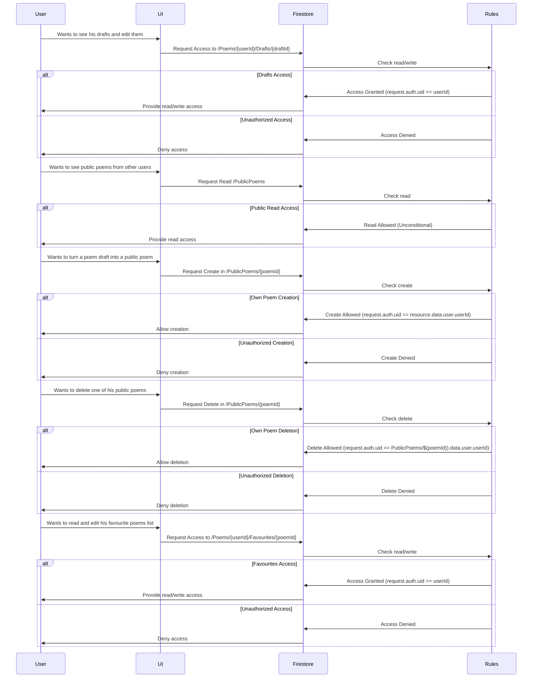

### Firestore Security Rules

Diagrama evidențiază cum regulile de securitate din Firestore sunt utilizate pentru a controla accesul utilizatorilor la diferite funcții ale aplicației. Fiecare flux începe cu o interacțiune a utilizatorului cu UI-ul, urmată de verificări de securitate în Firestore, care determină dacă acțiunea este permisă sau nu, bazându-se pe id-ul utilizatorului.

1.  **Drafturile Utilizatorului**: Utilizatorul solicită să vadă și să editeze drafturile sale prin UI. Cererea este transmisă la Firestore, unde regulile verifică dacă utilizatorul are permisiunea de a citi/scrie bazat pe autentificarea acestuia. Dacă ID-ul de utilizator corespunde, accesul este acordat; în caz contrar, este refuzat.
    
2.  **Vizualizarea Poeziilor Publice**: Utilizatorul dorește să vadă poeziile publice ale altor utilizatori. UI-ul transmite cererea la Firestore, care permite citirea acestora necondiționa.
    
3.  **Crearea unei Poezii Publice**: Când utilizatorul dorește să publice o poezie, UI-ul trimite o solicitare de creare la Firestore. Aici, regulile verifică dacă utilizatorul curent este cel care a creat poezia. Dacă da, crearea este permisă; dacă nu, este refuzată.
    
4.  **Ștergerea unei Poezii Publice**: Utilizatorul cere să șteargă una dintre poeziile sale publice prin UI. Firestore verifică dacă solicitantul este proprietarul poeziei. Dacă este adevărat, ștergerea este permisă; altfel, este refuzată.
    
5.  **Accesul la Lista de Poezii Favorite**: Utilizatorul dorește să citească și să editeze lista sa de poezii favorite. Solicitarea este inițiată prin UI și trimisă la Firestore, unde regulile verifică dacă utilizatorul are dreptul de a citi și scrie în această secțiune.

